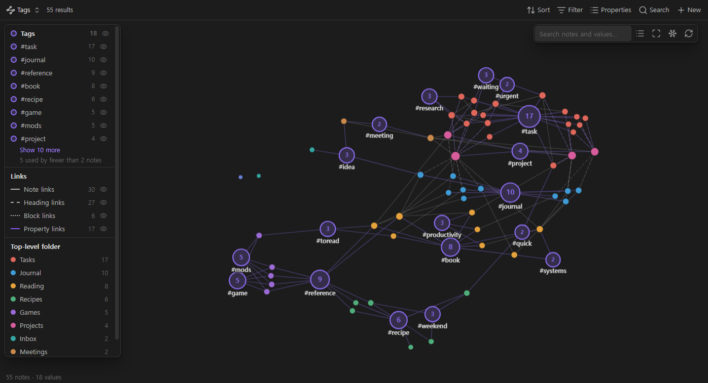
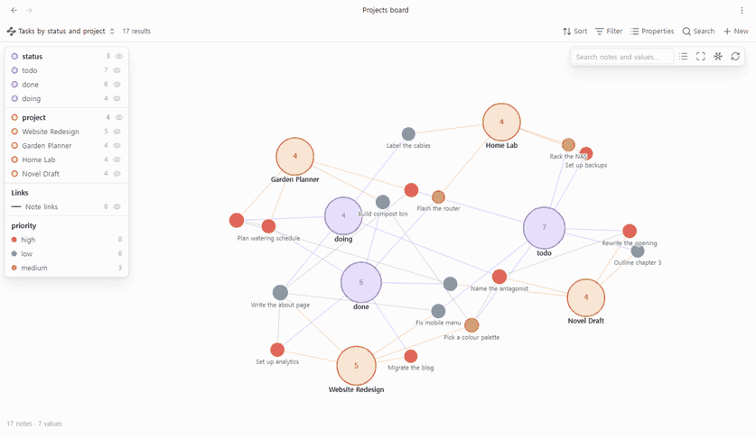
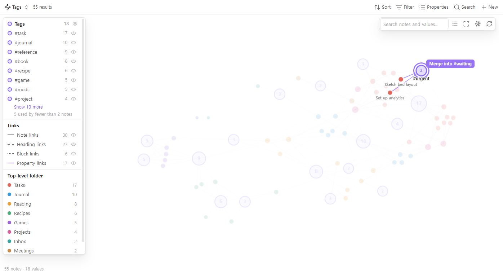
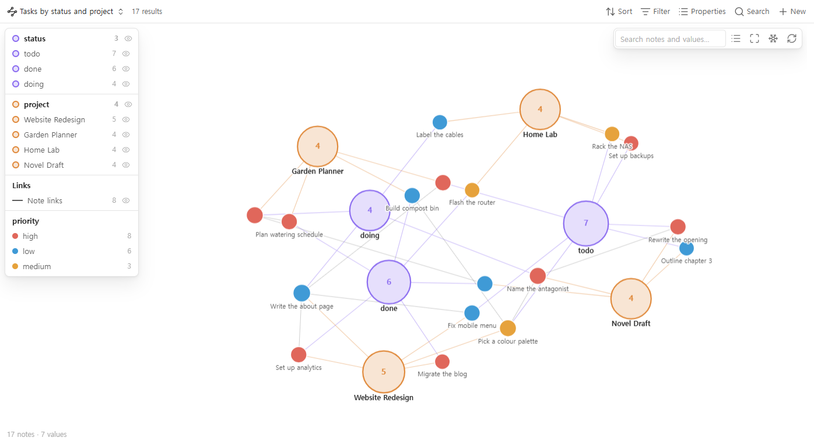
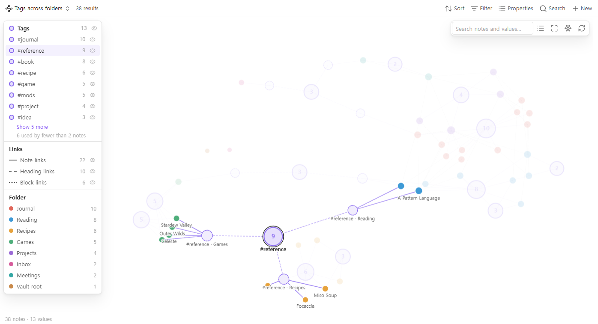

# Tag Graph

**A graph view for Bases where tags, folders and properties are the nodes — and
where you tag, retag and merge by dragging.**

Every tag (or folder, or `status`, or `project`, or any property) becomes a hub,
and every note that has it is pulled towards it. Notes that never link to each
other still end up side by side when they share a tag, so a vault held together
by tags and properties finally has a shape you can see. And the graph is not
read-only: drop a note on a tag to tag it, drop one tag on another to merge them.





---

## Built from what people asked for

Tag Graph started from reading six months of
[feature requests on the Obsidian forum](https://forum.obsidian.md/c/feature-requests/8)
(April–October 2026) and collecting the graph and tag requests that were still
open. Each row is a real thread; the right column is what Tag Graph does about it.

| What people asked for | What Tag Graph does |
|---|---|
| [Filter the graph by tag frequency](https://forum.obsidian.md/t/new-filter-for-graph-view-filter-based-on-tags-frequency/114559) — hide tags used only once, so typo tags stop cluttering the graph | **Hide values used by fewer notes than _n_** (default 2). The legend says how many were hidden. |
| [Folder-aware tags](https://forum.obsidian.md/t/folder-aware-tags-show-where-each-tag-was-actually-used-in-graph-view/118036) — see *which folder* a reused tag like `#toread` was used in, without typing `#games/toread` by hand | **Split values by folder**: one hub for the tag, plus a sub-hub for each folder it is used in. |
| [Toggle graph groups on and off quickly](https://forum.obsidian.md/t/graph-view-toggle-to-quickly-show-hide-groups/113301) | **An eye icon on every tag and every property** in the legend. Click a tag to highlight its notes. |
| [Multi-coloured nodes](https://forum.obsidian.md/t/multi-colored-nodes-in-graph-view/114732) — a note with several tags should show all their colours | **A pie slice per value**, up to four. |
| [Tell heading and block links apart](https://forum.obsidian.md/t/link-filter-and-separate-display-and-forces/117614) · [hide frontmatter links](https://forum.obsidian.md/t/an-option-to-disable-frontmatter-links-to-show-up-in-graph-view/114940) | **Note, heading (`[[a#b]]`), block (`[[a#^c]]`), property and embed links** are drawn differently, and each kind can be switched off. |
| [Search that highlights instead of hiding](https://forum.obsidian.md/t/enhanced-graph-search/113084) | **Matches get a ring, the rest stays on screen, dimmed.** <kbd>Enter</kbd> zooms to the matches. |
| [Freeze the graph](https://forum.obsidian.md/t/graph-view-freeze/116494) — stop it rearranging itself | **A seeded layout** that opens the same way every time, edits that only move the note you changed, and a **Freeze** button. |
| [Use Bases filters in the graph](https://forum.obsidian.md/t/support-bases-filters-in-graph-view/116692) instead of typing search syntax | **It is a Bases view**: the base's filters decide what is drawn. Graph one project, one folder or one query. |
| [A graph view you can work in](https://forum.obsidian.md/t/graph-view-plugin-that-allows-you-to-work-within-it/117857) · [a quicker way to add tags](https://forum.obsidian.md/t/add-a-new-command-add-tag-s-property/115978) | **Drag to tag.** Drop notes on tags and properties to change them, merge tags by dropping one on another — see below. |

---

## Drag to tag

The graph is a way to change your notes, not only to look at them.

| Drag | onto | does |
|---|---|---|
| a note | a tag or value | adds it (a list property gets it appended; a single-value property like `status` is set to it) |
| a note | a folder | moves the note into that folder |
| a note | a note that is a value (e.g. a project note) | sets that property to a link to it |
| a note | another note | adds a link to the other note in a property you choose (`related` by default) |
| a tag | another tag | **merges** them: every note in the base gets the second tag instead of the first |

Right-click a tag or value to **rename** it across the notes in the base — in
the `tags` property and in `#tags` written in the note text — or to **create a
new note** that already has it. Right-click a note to **remove** one of its tags
or values.

Every edit shows a notice with **Undo**, and *Undo last edit* is a command too.
Undo only goes ahead if the files are still exactly as the edit left them.



---

## More than tags

Tags are the first hub property, but you can pick up to four: any note property
(`status`, `project`, `author`, `area`…), formulas, `file.folder` or `file.ext`.
A property that holds links, such as `project: "[[Home Lab]]"`, joins its notes
straight to the project note when that note is in the graph.





Notes are coloured by any property you choose, by the base's grouping, or — by
default — by top-level folder, so where a note lives shows at a glance.

---

## Getting started

1. Install **Tag Graph** from *Settings → Community plugins*. The **Bases** core
   plugin must be on.
2. Run **Tag Graph: Create a base with a tag graph** from the command palette.
   Or open any `.base` file, select **Add view**, and choose **Tag graph**.
3. That's it: tags are the hubs until you pick other **hub properties** in the
   view options.

### Using the graph

- **Click** a note to open it (<kbd>Ctrl</kbd>/<kbd>Cmd</kbd>-click: new tab).
  <kbd>Ctrl</kbd>/<kbd>Cmd</kbd>-hover for a page preview.
- **Click** a tag to highlight its notes. **Double-click** it to zoom to them.
- **Drag** to edit. While you drag, the note's own connections stay highlighted
  and the target under the pointer holds still.
- **Scroll** to zoom, **drag the background** to pan. <kbd>Esc</kbd> cancels a
  drag and clears the highlight.
- **On a phone or tablet:** pinch to zoom, tap a note to see its tags, tap again
  to open it, long-press for the menu.

### View options

| Option | Default | |
|---|---|---|
| Property 1–4 | Tags, none, none, none | Note properties, formulas, `file.tags`, `file.folder`, `file.ext` |
| Hide values used by fewer notes than | 2 | A value that is itself a note in the graph is always drawn |
| Split values by folder | off | |
| Colour notes by | grouping, else top-level folder | |
| Show notes with no connections | on | |
| Note dropped on note links it in | `related` | Leave empty to switch off |

### Settings

- **Confirm before changing many notes** (on) — before a merge that touches more
  than one note.
- **Confirm before moving files** (on) — before a drop on a folder moves a note.
- **Change tags in the note text too** (on) — renames, merges and removals also
  change `#tags` in the body, not only the `tags` property. Only the exact tag is
  changed: `#todo/sub` is a different tag from `#todo`.
- **Animate the layout** (on) — off lays the graph out before showing it and
  then keeps it still.
- **Show the editing hint** (on).

The interface is in English and Korean, following Obsidian's language.

---

## What it touches

- **Reads** the notes the base returns, and their metadata from Obsidian's cache.
- **Writes** only when you drop, rename, merge, remove or create — and only to
  the notes the base returns. A rename never reaches notes outside the base.
  Frontmatter is changed through Obsidian's own `processFrontMatter`; moves go
  through Obsidian's file manager, so links are updated as your settings say.
- **No network.** The plugin makes no requests and loads no code at runtime.
  d3-force is bundled into `main.js`.

## Limits

- Calculated values (formulas, and file properties other than tags and folder)
  are drawn but cannot be changed by dragging.
- Undo covers the last edit only.
- Built for bases of up to a few thousand notes. On 3,000 notes the first layout
  takes about a quarter of a second.

## Feedback

Found a bug, or a request this should answer? Open an
[issue](https://github.com/elliott-json-park/obsidian-tag-graph/issues).

## Building

```bash
npm install
npm test
```

`npm test` type-checks, builds `main.js`, runs the unit tests in
`scripts/test.mjs` (graph model and frontmatter edits) and checks the bundle for
network calls, `innerHTML`, `console.log` and manifest consistency.
`npm run demo-vault -- <dir>` writes the sample vault used for the screenshots.

## License

MIT © Elliott Park. Includes d3-force and its dependencies (ISC) — see
[THIRD-PARTY-NOTICES.md](THIRD-PARTY-NOTICES.md).
